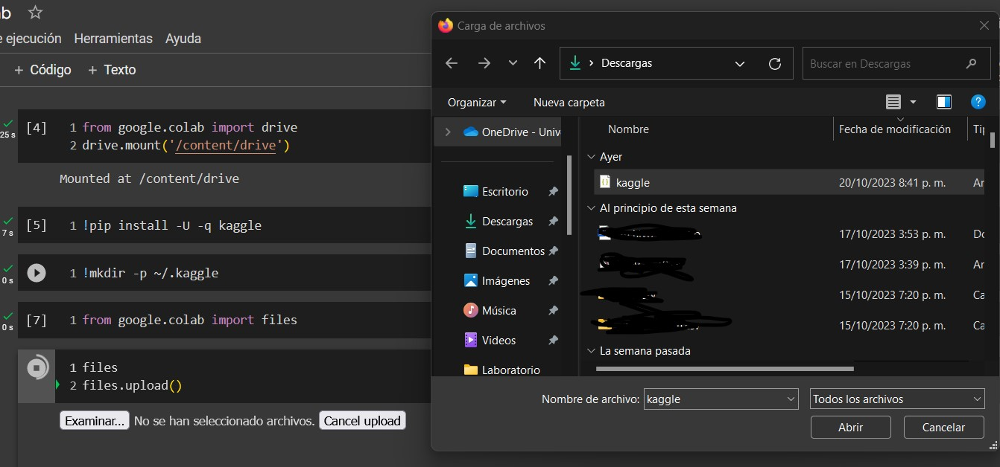

# Predicting_molecular_propertis
## ESTUDIANTES:
Andrés David Medina Herrera - CC1003562902 - BIOINGENIERIA

Miguel Arias Londoño - CC1017272204 - BIOINGENIERIA
## DATOS:
Para que los datos esten disponibles en el colab es necesario obtener un archivo kaggle.json desde la pagina de kaggle:
- Loguearse a la cuenta de Kaggle o crear una cuenta.
- Ir al perfil público -> configuraciones.
- Buscar el titulo "API",se debe descargar el token dando click en "Generar nuevo token"
- Se decargara un archivo .json el cual debe ser cargado como se ve en la imagen

